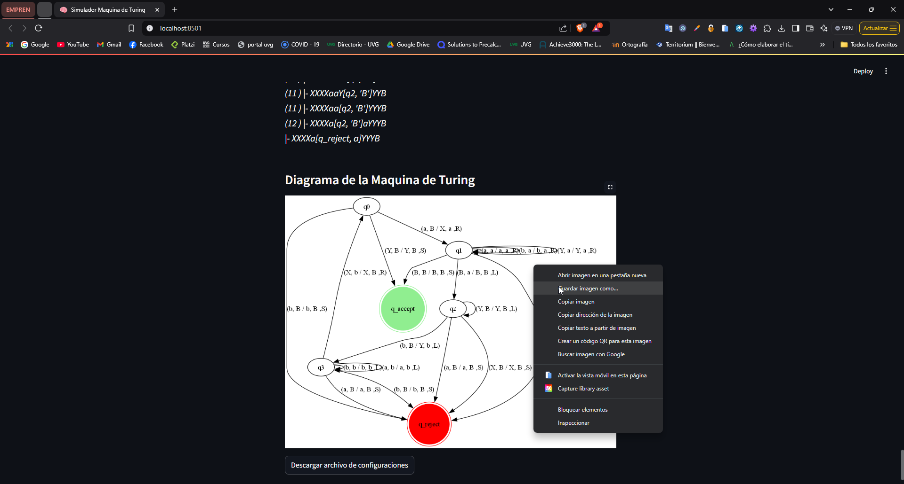
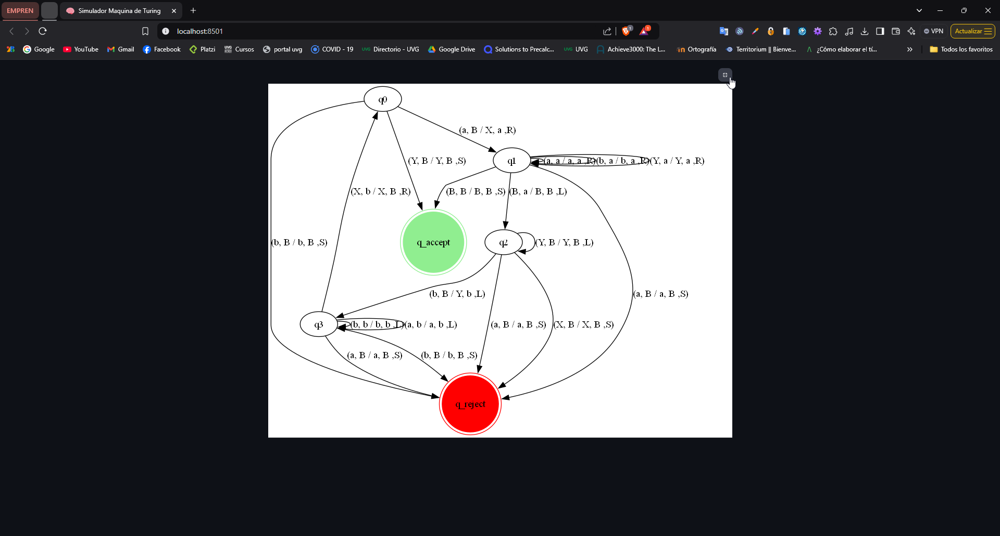
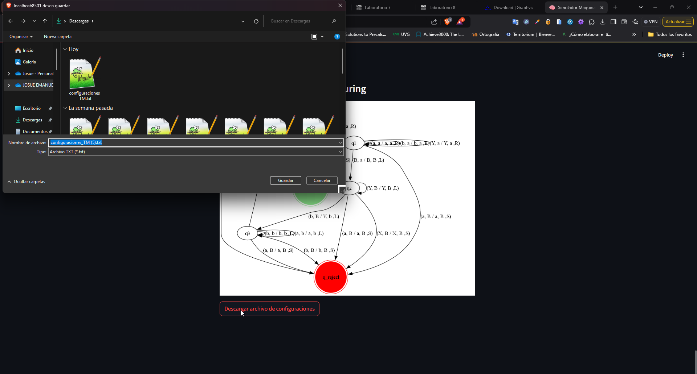
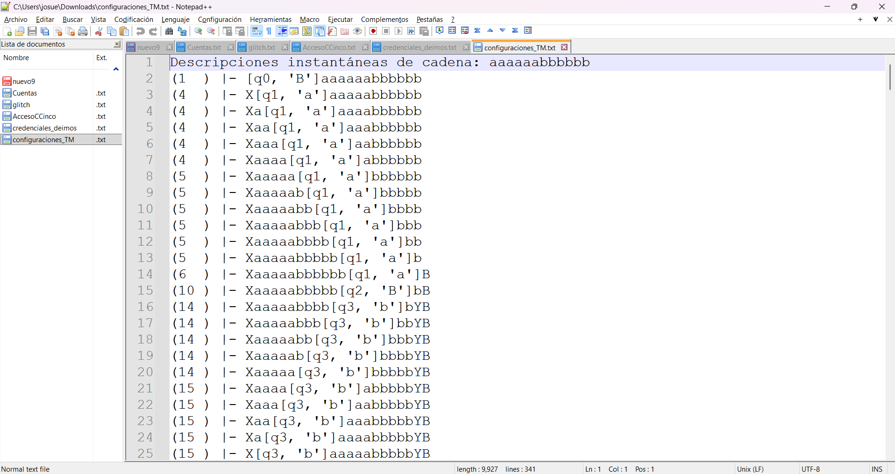

# 🤖 Turing Machine

Este proyecto implementa una **Máquina de Turing Monocinta**, configurable a través de archivos `.yaml`.

## 🎥 Video demostración
[⭕ **VIDEO DEMO**](#)

---

## 🚀 Getting Started

### 1️⃣ Instalar dependencias

Si planeas usar un ambiente virtual, configúralo antes de instalar las dependencias:

```bash
pip install -r requirements.txt
```

### 2️⃣ Instalar Graphviz

Esta librería de Python requiere que instales el programa **Graphviz**. Puedes descargarlo desde este [enlace oficial](https://graphviz.org/download/).

#### 📌 En sistemas operativos:
- **Ubuntu/Debian**:
  ```bash
  sudo apt install graphviz
  ```
- **MacOS**:
  ```bash
  sudo port install graphviz
  ```
- **Windows**: 
  Descarga la versión correspondiente a tu sistema (32 o 64 bits) y **añade el directorio `bin` a las variables de entorno del sistema**.

---

## 📁 Organización de carpetas

La estructura de carpetas del proyecto es la siguiente:

```bash
CT-Turing-Machine/
├── files/
│   ├── alteration_machine.yaml  # Máquina alteradora
│   └── recognition_machine.yaml # Máquina reconocedora
├── graphs/
│   ├── maquina_turing           # Diagrama de la máquina
│   └── maquina_turing.png       # Diagrama visual
├── src/
│   ├── main.py                  # Frontend del programa
│   ├── reader.py                # Lector de configuración YAML
│   └── TM.py                    # Lógica de la Máquina de Turing
├── docs/
│   ├── example_diagram_frontend.png
│   ├── example_txt_download.png
│   ├── example_txt_configuration.png
│   └── example_diagram_frontend_full_screen.png
└── requirements.txt
```

### 📂 Descripción de carpetas

1. **`files/`**: Contiene los archivos `.yaml` que definen la configuración de la máquina (estados, alfabeto, transiciones, etc.). Puedes modificar estos archivos para ajustar la lógica de la máquina.

2. **`graphs/`**: Almacena el diagrama generados automáticamente según las configuraciones definidas en el archivo `.yaml` utilizado.

3. **`src/`**: Contiene los scripts principales del proyecto:
   - **`main.py`**: Frontend para interactuar con la máquina.
   - **`reader.py`**: Lógica para interpretar archivos `.yaml`.
   - **`TM.py`**: Implementación de la Máquina de Turing.

---

## 🛠️ Funcionamiento del programa

### ▶️ Ejecutar el programa

Ejecuta el siguiente comando para iniciar el frontend:

```bash
streamlit run ./src/main.py
```

Esto abrirá una ventana en tu navegador. Si no se abre automáticamente, copia y pega la URL que aparece en la consola (indicada como *Local URL*).

### ⚙️ Configurar la máquina

1. Carga un archivo `.yaml` desde la carpeta `files/`:
   - **Ejemplo**: `recognition_machine.yaml` o `alteration_machine.yaml`.
2. El programa validará el archivo y confirmará si cumple con la estructura requerida. 
3. Una vez validado, podrás observar el comportamiento de la máquina con las cadenas de simulación definidas en el archivo.

### 📋 Descripciones instantáneas

El programa genera las **descripciones instantáneas** para cada transición. La sintaxis es:

```plaintext
(Num. de transición) |- [Estado actual, Cache actual] Cadena restante
```

Por ejemplo:
```
(1) |- [q0, B]110
```

### 📊 Diagrama y descargas

En la parte inferior de la página encontrarás:
1. **Diagrama de la Máquina de Turing** generado a partir del archivo `.yaml`.
2. Opciones para descargar:
   - El diagrama en formato `.png`.
   - Un archivo `.txt` con las descripciones instantáneas generadas.

#### Ejemplos:

| **Diagrama** | **Archivo TXT** |
|--------------|------------------------------------------|
|  |   |

